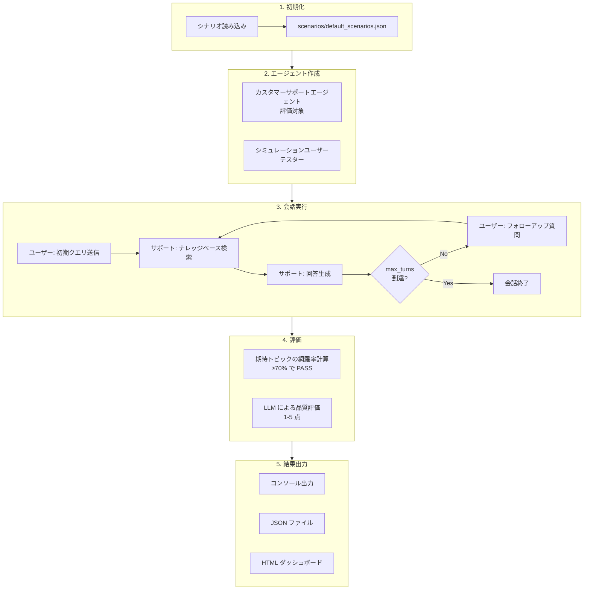

# Agent Eval Sample

Strands Agents SDK を使用した AI エージェント評価フレームワークのサンプル実装です。シミュレーションユーザーエージェントを使って、カスタマーサポートエージェントの応答品質を自動評価します。

## 主な機能

- **シミュレーションユーザーによる自動評価**: 実際のユーザー行動を模倣したエージェントがテストを実行
- **複数ペルソナのサポート**: 丁寧、困惑、詳細要求など様々なユーザータイプをシミュレート
- **マルチターン会話**: 複数ターンにわたる会話シナリオの評価に対応
- **セマンティック検索**: Cohere Embed を使用した高精度なナレッジベース検索
- **並列実行**: 複数シナリオの同時実行による高速な評価
- **HTML ダッシュボード**: 評価結果の可視化とレポート生成
- **JSON シナリオ定義**: 柔軟なシナリオ設定と管理

## アーキテクチャ

```
src/
├── agents/
│   ├── customer_support_agent.py  # 評価対象のカスタマーサポートエージェント
│   └── simulated_user_agent.py    # テスト実行用シミュレーションユーザー
├── tools/
│   └── knowledge_search.py        # セマンティック検索ツール（Cohere Embed）
├── evaluation/
│   ├── evaluator.py               # 評価ロジックとオーケストレーション
│   ├── scenarios.py               # シナリオ定義とJSON読み込み
│   └── dashboard.py               # HTML ダッシュボード生成
└── main.py                        # CLI エントリーポイント

knowledge/                         # ナレッジベース（Markdown形式）
└── sample_faq.md                  # カスタマーサポートFAQ

scenarios/                         # シナリオ定義
└── default_scenarios.json         # デフォルト評価シナリオ

output/                            # 評価結果出力
├── dashboard_*.html               # HTML ダッシュボード
└── results_*.json                 # JSON 形式の結果
```

## 評価フロー



## セットアップ

### 必要要件

- Python 3.10 以上
- AWS アカウント（Bedrock アクセス権限）
- uv（Python パッケージマネージャー）

### インストール

```bash
# 依存関係のインストール
uv sync

# 開発用依存関係を含めてインストール
uv sync --all-extras
```

### AWS 設定

このプロジェクトは Amazon Bedrock を使用します。AWS 認証情報を設定してください：

```bash
# AWS CLI で設定
aws configure

# または環境変数で設定
export AWS_ACCESS_KEY_ID=your_access_key
export AWS_SECRET_ACCESS_KEY=your_secret_key
export AWS_REGION=us-west-2
```

**必要な IAM 権限:**
- `bedrock:InvokeModel` - Claude モデル呼び出し用
- `bedrock:InvokeModelWithResponseStream` - ストリーミング応答用

**使用モデル:**
- Claude Sonnet 4.5 (カスタマーサポートエージェント)
- Claude Haiku 4.5 (シミュレーションユーザー、評価)
- Cohere Embed Multilingual v3 (セマンティック検索)

## 使用方法

### 基本的な実行

```bash
# 全シナリオを実行
uv run python -m src.main

# 特定のシナリオのみ実行
uv run python -m src.main --scenario return_policy

# 利用可能なシナリオを一覧表示
uv run python -m src.main --list-scenarios
```

### 出力オプション

```bash
# 会話ログを詳細表示
uv run python -m src.main --show-conversations

# HTML ダッシュボードを生成
uv run python -m src.main --dashboard

# ダッシュボードを生成してブラウザで開く
uv run python -m src.main --open-dashboard

# 出力ディレクトリを指定
uv run python -m src.main --dashboard --output-dir ./reports
```

### 実行制御

```bash
# 逐次実行（並列ではなく順番に実行）
uv run python -m src.main --sequential

# 並列ワーカー数を指定（デフォルト: 3）
uv run python -m src.main --workers 5

# カスタムシナリオファイルを使用
uv run python -m src.main --scenarios-json path/to/custom_scenarios.json
```

### CLI オプション一覧

| オプション | 説明 | デフォルト |
|-----------|------|----------|
| `--scenario` | 特定のシナリオのみ実行 | 全シナリオ |
| `--scenarios-json` | カスタムシナリオファイルのパス | `scenarios/default_scenarios.json` |
| `--list-scenarios` | 利用可能なシナリオを一覧表示 | - |
| `--show-conversations` | 会話ログを詳細表示 | False |
| `--dashboard` | HTML ダッシュボードを生成 | False |
| `--open-dashboard` | ダッシュボードを生成してブラウザで開く | False |
| `--output-dir` | 出力ディレクトリ | `output/` |
| `--sequential` | 逐次実行モード | False（並列） |
| `--workers` | 並列ワーカー数 | 3 |

## シナリオ定義

### 基本シナリオ

`scenarios/default_scenarios.json` を編集するか、新しい JSON ファイルを作成します：

```json
{
  "version": "1.0",
  "description": "カスタム評価シナリオ",
  "scenarios": [
    {
      "name": "unique_scenario_name",
      "scenario_number": 1,
      "description": "シナリオの説明",
      "initial_query": "ユーザーの最初の質問",
      "expected_topics": ["期待キーワード1", "期待キーワード2"],
      "expected_tool_use": true,
      "persona": "polite",
      "max_turns": 3,
      "user_context": "ユーザーの背景情報（任意）",
      "user_goal": "ユーザーの達成目標"
    }
  ]
}
```

### シナリオフィールド

| フィールド | 型 | 必須 | 説明 |
|-----------|---|-----|------|
| `name` | string | ○ | シナリオの一意識別子 |
| `scenario_number` | int | - | シナリオ番号（表示用） |
| `description` | string | ○ | シナリオの説明 |
| `initial_query` | string | ○ | ユーザーの最初の質問 |
| `expected_topics` | string[] | ○ | 期待される回答に含まれるべきキーワード |
| `expected_tool_use` | bool | - | ツール使用が期待されるか（デフォルト: true） |
| `persona` | string | - | ユーザーペルソナ（デフォルト: polite） |
| `max_turns` | int | - | 最大会話ターン数（デフォルト: 3） |
| `user_context` | string | - | ユーザーの状況説明 |
| `user_goal` | string | - | ユーザーの目標 |
| `conversation_flow` | object[] | - | マルチターン会話フロー定義 |

### ユーザーペルソナ

| ペルソナ | 説明 |
|---------|------|
| `polite` | 丁寧で協力的なユーザー |
| `frustrated` | 困っていて焦っているユーザー |
| `confused` | 手順がわからず混乱しているユーザー |
| `detailed` | 詳細な説明を求めるユーザー |
| `curt` | 簡潔でぶっきらぼうなユーザー |

### マルチターンシナリオ

複数ターンにわたる会話フローを定義できます：

```json
{
  "name": "multi_turn_example",
  "description": "マルチターン会話の例",
  "initial_query": "商品を返品したいのですが",
  "expected_topics": ["30日", "未開封", "返金"],
  "persona": "polite",
  "max_turns": 6,
  "user_context": "1週間前に購入した商品を返品希望",
  "user_goal": "返品手続きの完了",
  "conversation_flow": [
    {
      "turn": 1,
      "expected_agent_action": "返品ポリシーの説明",
      "user_response_hint": "返品理由を説明"
    },
    {
      "turn": 2,
      "expected_agent_action": "返品手続きの案内",
      "user_response_hint": "手続き方法の確認"
    },
    {
      "turn": 3,
      "expected_agent_action": "返金方法の説明",
      "user_response_hint": null
    }
  ]
}
```

## ナレッジベース

ナレッジベースは `knowledge/` ディレクトリ内の Markdown ファイルで構成されます。

### 形式

```markdown
## カテゴリ名

### トピック1

トピック1の詳細な説明...

### トピック2

トピック2の詳細な説明...
```

### 検索の仕組み

1. Markdown ファイルを `## ` と `### ` ヘッダーでセクション分割
2. 各セクションを Cohere Embed でベクトル化
3. ユーザークエリとのコサイン類似度で関連セクションを検索
4. 上位の関連セクションをコンテキストとしてエージェントに提供

## 評価基準

### スコア計算

評価スコアは期待トピックの網羅率で計算されます：

```
スコア = 網羅されたトピック数 / 期待トピック総数
```

### 判定基準

| スコア | 判定 | 説明 |
|--------|------|------|
| ≥ 0.7 | PASS | 期待トピックの70%以上を網羅 |
| 0.5 - 0.7 | PARTIAL | 一部のトピックを網羅 |
| < 0.5 | FAIL | 網羅が不十分 |

### LLM 評価

会話全体の品質を Claude Haiku で 1-5 点で評価：

- **5点**: 完璧な対応、全ての情報を正確に提供
- **4点**: 良い対応、ほぼ全ての情報を提供
- **3点**: 標準的な対応、基本情報を提供
- **2点**: 不十分な対応、重要な情報が欠落
- **1点**: 不適切な対応、誤情報または無関係な回答

## ダッシュボード

`--dashboard` または `--open-dashboard` オプションで HTML ダッシュボードを生成できます。

### ダッシュボードの内容

- **概要サマリー**: 全体の成功率、平均スコア
- **シナリオ別カード**: 各シナリオの結果詳細
- **会話ログ**: ユーザーとエージェントのやり取り
- **ツール使用状況**: ナレッジベース検索の呼び出し履歴
- **トピック網羅状況**: 期待トピックの達成状況

## 開発

### コード品質ツール

```bash
# フォーマット
uv run ruff format .

# リント（チェックのみ）
uv run ruff check .

# リント（自動修正）
uv run ruff check . --fix

# 型チェック
uv run pyright

# テスト実行
PYTEST_DISABLE_PLUGIN_AUTOLOAD="" uv run pytest
```

### プロジェクト構成

- **Strands Agents SDK**: エージェントフレームワーク
- **Amazon Bedrock**: LLM プロバイダー（Claude）
- **Cohere Embed**: セマンティック検索用埋め込みモデル
- **NumPy**: ベクトル計算（コサイン類似度）

## ライセンス

MIT License
